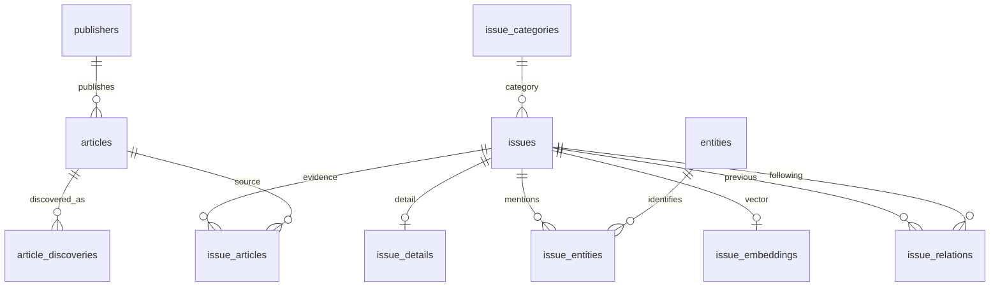
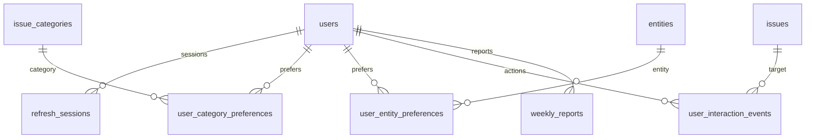
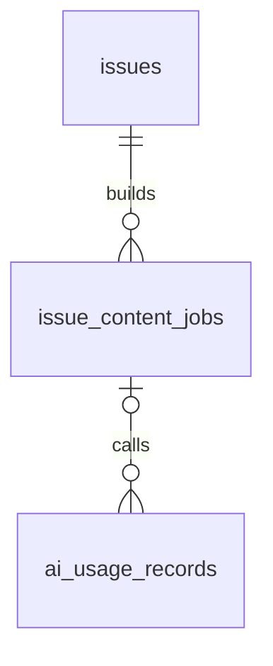

# ERD · v1.2

상단 Notion 컬럼 명세 기준 19개 테이블이다. article_discoveries는 도입 검토 중인 선택 테이블이다. 이 문서는 DDL이 아니며 DB에 제약을 생성하지 않는다.

## 표기

- PK: 기본키, FK: 외래키, UK: 단일 UNIQUE. 복합 UNIQUE는 각 설명을 따른다.
- NULL의 불가는 NOT NULL이다. 기본값 —는 자동값이 확정되지 않았음을 뜻한다. 신규 영속 ID의 UUID 버전은 v7이며 `libs/core` 애플리케이션 생성기를 사용한다.
- 시각은 timestamptz, 주간 경계는 KST 기준 date. enum 표시는 현재 text의 허용값이며 PostgreSQL ENUM 타입 채택을 의미하지 않는다.
- NOT NULL만으로 공개 가능성을 보장하지 않는다. 상태별 검사와 JSON 참조 검사가 필요하다.

## 영속 ID 정책

- DB에 저장할 신규 내부 UUID 식별자는 UUIDv7으로 생성한다. 목적은 시간에 가까운 키 배치로 B-tree 삽입 locality를 높이고 ID 범위 조회에 활용하는 것이다.
- PostgreSQL에는 문자열이 아닌 `uuid` 타입으로 저장한다. 타입 선언만으로 UUID 버전이 강제되지는 않으므로 `libs/core`의 UUIDv7 ID 생성기가 `uuid` 라이브러리 기반 애플리케이션 생성 경로를 제공하고 실제 생성·저장 왕복을 검증한다.
- FK와 PK 겸 FK는 참조 대상 ID를 그대로 사용한다. 관계를 저장할 때 새 UUID를 생성하지 않는다. 별도 식별자를 가진 연결 행의 신규 PK는 UUIDv7으로 생성한다.
- UUIDv7을 전역 순번이나 트랜잭션 커밋 순서로 취급하지 않는다. 업무 시각 기준 조회·정렬은 해당 시각 컬럼과 쿼리에 맞는 인덱스로 설계한다.
- 요청 추적용 `requestId`는 영속 엔티티 ID 정책과 별개다. 기존 ID·외부 시스템 식별자·재전송된 이벤트 ID를 새 UUID로 치환하지 않는다.

2026-09-12 사용자 결정으로 UUIDv7과 애플리케이션 생성 방식을 확정했다. 실제 업무 엔티티 매핑과 마이그레이션은 데이터 모델 단계에서 추가한다.

## 01. publishers

언론사 식별. url은 대표 주소이며 전역 UNIQUE를 강제하지 않는다.

| 컬럼 | 타입 | 키 | NULL | 기본값 | 허용값·참조·비고 |
| --- | --- | --- | --- | --- | --- |
| id | uuid | PK | 불가 | — | — |
| name | text | — | 불가 | — | — |
| url | text | — | 허용 | — | — |

## 02. articles

보도 메타데이터. 정규화한 article_url로 중복 방지. 타 언론사 전재는 별도 기사이며 독립 근거인지는 별도 판단한다.

| 컬럼 | 타입 | 키 | NULL | 기본값 | 허용값·참조·비고 |
| --- | --- | --- | --- | --- | --- |
| id | uuid | PK | 불가 | — | — |
| publisher_id | uuid | FK | 불가 | — | publishers.id |
| article_url | text | UK | 불가 | — | — |
| title | text | — | 불가 | — | — |
| description | text | — | 허용 | — | — |
| reporter | text | — | 허용 | — | — |
| published_at | timestamptz | — | 허용 | — | 언론사 발행 시각 |
| fetched_at | timestamptz | — | 불가 | — | — |
| source_status | text | — | 불가 | — | AVAILABLE / REMOVED / UNKNOWN |
| created_at | timestamptz | — | 불가 | now() | — |

## 03. article_discoveries

선택 테이블: 공급자 조사 후 도입 여부 결정. 도입하면 UNIQUE(provider, provider_url). 동일 원문은 같은 article_id를 참조한다.

| 컬럼 | 타입 | 키 | NULL | 기본값 | 허용값·참조·비고 |
| --- | --- | --- | --- | --- | --- |
| id | uuid | PK | 불가 | — | — |
| article_id | uuid | FK | 불가 | — | articles.id |
| provider | text | — | 불가 | — | GOOGLE / NAVER / 공급자 코드 |
| provider_url | text | — | 불가 | — | — |
| created_at | timestamptz | — | 불가 | now() | — |

## 04. issues

구체적인 사건·발표·전개와 공개 상태. category_id는 대표 분류, sub_category는 선택 텍스트다. published_at은 최초 서비스 공개 시각이다.

| 컬럼 | 타입 | 키 | NULL | 기본값 | 허용값·참조·비고 |
| --- | --- | --- | --- | --- | --- |
| id | uuid | PK | 불가 | — | — |
| title | varchar(40) | — | 불가 | — | — |
| event_at | timestamptz | — | 허용 | — | 사건 발생 시각 |
| category_id | uuid | FK | 불가 | — | issue_categories.id |
| sub_category | text | — | 허용 | — | — |
| publication_status | text | — | 불가 | — | UNPUBLISHED / PUBLISHED / WITHDRAWN |
| freshness_score | numeric | — | 불가 | 0 | — |
| importance_score | numeric | — | 불가 | 0 | — |
| published_at | timestamptz | — | 허용 | — | 최초 서비스 공개 시각 |
| created_at | timestamptz | — | 불가 | now() | — |
| updated_at | timestamptz | — | 불가 | — | — |

## 05. issue_details

이슈당 현재 상세 0..1행. integrated_summary는 1줄, summary_lines는 문자열 3개. glossary는 0..5개. 전체 버전 행을 누적하지 않는다.

| 컬럼 | 타입 | 키 | NULL | 기본값 | 허용값·참조·비고 |
| --- | --- | --- | --- | --- | --- |
| issue_id | uuid | PK,FK | 불가 | — | issues.id |
| integrated_summary | text | — | 불가 | — | — |
| summary_lines | jsonb | — | 불가 | — | — |
| viewpoints | jsonb | — | 허용 | — | — |
| glossary | jsonb | — | 불가 | — | — |
| created_at | timestamptz | — | 불가 | — | — |

## 06. issue_articles

근거 기사만 연결. PK(issue_id, article_id). 단순 관련 기사를 검증 없이 추가하지 않는다.

| 컬럼 | 타입 | 키 | NULL | 기본값 | 허용값·참조·비고 |
| --- | --- | --- | --- | --- | --- |
| issue_id | uuid | PK,FK | 불가 | — | issues.id |
| article_id | uuid | PK,FK | 불가 | — | articles.id |
| sort_order | int | — | 허용 | — | — |

## 07. entities

인물·정당·기관. 동명이인이 있으므로 name 전역 UNIQUE 금지. 식별되지 않은 대상을 임의 연결하지 않는다.

| 컬럼 | 타입 | 키 | NULL | 기본값 | 허용값·참조·비고 |
| --- | --- | --- | --- | --- | --- |
| id | uuid | PK | 불가 | — | — |
| name | text | — | 불가 | — | — |
| type | text | — | 불가 | — | POLITICIAN / PARTY / INSTITUTION |
| subtitle | text | — | 허용 | — | — |
| aliases | text[] | — | 불가 | — | — |
| is_active | boolean | — | 불가 | — | — |
| created_at | timestamptz | — | 불가 | now() | — |

## 08. issue_entities

등장 대상 연결. UUID PK 유지. 복합 UNIQUE(issue_id, entity_id)를 추가한다.

| 컬럼 | 타입 | 키 | NULL | 기본값 | 허용값·참조·비고 |
| --- | --- | --- | --- | --- | --- |
| issue_entities_id | uuid | PK | 불가 | — | — |
| issue_id | uuid | FK | 불가 | — | issues.id |
| entity_id | uuid | FK | 불가 | — | entities.id |

## 09. issue_categories

대표 분류 값 테이블. 이슈와 사용자 분류 선호가 참조한다. 보조 주제 연결 테이블은 두지 않는다.

| 컬럼 | 타입 | 키 | NULL | 기본값 | 허용값·참조·비고 |
| --- | --- | --- | --- | --- | --- |
| id | uuid | PK | 불가 | — | — |
| name | text | — | 불가 | — | — |

## 10. issue_embeddings

현재 모델의 검색용 벡터. UUID PK 유지, UNIQUE(issue_id) 추가. 입력은 issues.title + issue_details.integrated_summary. 모델은 설정에서 하나로 고정한다.

| 컬럼 | 타입 | 키 | NULL | 기본값 | 허용값·참조·비고 |
| --- | --- | --- | --- | --- | --- |
| issue_embedding_id | uuid | PK | 불가 | — | — |
| issue_id | uuid | FK | 불가 | — | issues.id |
| embedding | vector(D) | — | 불가 | — | D 및 모델 미확정. 다른 모델 벡터 혼합 비교 금지 |
| input_version | text | — | 불가 | — | 입력 텍스트 조합 규격 |
| input_hash | text | — | 불가 | — | 실제 입력 텍스트 해시 |
| embedded_at | timestamptz | — | 불가 | — | — |

## 11. issue_relations

검증된 이전→후속 관계. PK(from_issue_id, to_issue_id, relation_type), CHECK(from_issue_id <> to_issue_id). 등록 직렬화 범위에서 순환·근거 검사.

| 컬럼 | 타입 | 키 | NULL | 기본값 | 허용값·참조·비고 |
| --- | --- | --- | --- | --- | --- |
| from_issue_id | uuid | PK,FK | 불가 | — | issues.id |
| to_issue_id | uuid | PK,FK | 불가 | — | issues.id |
| relation_type | text | PK | 불가 | — | FOLLOW_UP |
| reason | text | — | 불가 | — | — |
| evidence_refs | jsonb | — | 불가 | — | — |
| verified_at | timestamptz | — | 불가 | — | — |

## 12. users

카카오 식별자로 로그인. 이메일로 계정을 병합하지 않는다. 온보딩 완료와 건너뛰기를 구분한다.

| 컬럼 | 타입 | 키 | NULL | 기본값 | 허용값·참조·비고 |
| --- | --- | --- | --- | --- | --- |
| id | uuid | PK | 불가 | — | — |
| kakao_id | text | UK | 불가 | — | — |
| email | text | — | 허용 | — | — |
| onboarding_status | text | — | 불가 | — | PENDING / COMPLETED / SKIPPED |
| onboarding_completed_at | timestamptz | — | 허용 | — | — |
| created_at | timestamptz | — | 불가 | — | — |

## 13. refresh_sessions

원문 토큰 대신 해시 저장. 기존 토큰 소비와 신규 발급은 원자적으로 처리. 소비된 해시는 만료까지 유지한다.

| 컬럼 | 타입 | 키 | NULL | 기본값 | 허용값·참조·비고 |
| --- | --- | --- | --- | --- | --- |
| id | uuid | PK | 불가 | — | — |
| user_id | uuid | FK | 불가 | — | users.id |
| token_hash | text | UK | 불가 | — | — |
| expires_at | timestamptz | — | 불가 | — | — |
| used_at | timestamptz | — | 허용 | — | — |
| revoked_at | timestamptz | — | 허용 | — | — |
| created_at | timestamptz | — | 불가 | — | — |

## 14. user_category_preferences

분류별 추천 가중치. UUID PK 유지, 복합 UNIQUE(user_id, category_id) 추가. 온보딩 선택 +2.

| 컬럼 | 타입 | 키 | NULL | 기본값 | 허용값·참조·비고 |
| --- | --- | --- | --- | --- | --- |
| user_category_preferences_id | uuid | PK | 불가 | — | — |
| user_id | uuid | FK | 불가 | — | users.id |
| category_id | uuid | FK | 불가 | — | issue_categories.id |
| weight | numeric | — | 불가 | — | — |

## 15. user_entity_preferences

대상별 추천 가중치. UUID PK 유지, 복합 UNIQUE(user_id, entity_id) 추가. 온보딩 +2, 행동으로 신규 행 생성 가능.

| 컬럼 | 타입 | 키 | NULL | 기본값 | 허용값·참조·비고 |
| --- | --- | --- | --- | --- | --- |
| user_entity_preference_id | uuid | PK | 불가 | — | — |
| user_id | uuid | FK | 불가 | — | users.id |
| entity_id | uuid | FK | 불가 | — | entities.id |
| weight | numeric | — | 불가 | — | — |

## 16. user_interaction_events

불변 행동 이벤트. 재전송은 같은 id 사용. previous_action은 서버가 확인한 직전 행동, 최초 NULL. created_at은 서버 수용 시각 및 주간 집계 기준.

| 컬럼 | 타입 | 키 | NULL | 기본값 | 허용값·참조·비고 |
| --- | --- | --- | --- | --- | --- |
| id | uuid | PK | 불가 | — | — |
| user_id | uuid | FK | 불가 | — | users.id |
| issue_id | uuid | FK | 불가 | — | issues.id |
| session_id | uuid | — | 불가 | — | 접속 시 채번; refresh 세션 FK 아님 |
| event_type | text | — | 불가 | — | LIKE / SKIP / PASS |
| dwell_time | int | — | 허용 | — | 밀리초(ms), 0 이상, 미측정 NULL |
| previous_action | text | — | 허용 | — | LIKE / SKIP / PASS 또는 NULL |
| created_at | timestamptz | — | 불가 | now() | — |

## 17. weekly_reports

상태와 현재 결과. 복합 UNIQUE(user_id, period_start) 추가. period_end=period_start+7일. SUCCEEDED이면 content 필수. 최초 성공 결과 고정.

| 컬럼 | 타입 | 키 | NULL | 기본값 | 허용값·참조·비고 |
| --- | --- | --- | --- | --- | --- |
| id | uuid | PK | 불가 | — | — |
| user_id | uuid | FK | 불가 | — | users.id |
| period_start | date | — | 불가 | — | — |
| period_end | date | — | 불가 | — | — |
| status | text | — | 불가 | — | QUEUED / RUNNING / SUCCEEDED / FAILED |
| content | jsonb | — | 허용 | — | SUCCEEDED이면 필수; 분석 근거 ID 서버 검사 |
| model | text | — | 허용 | — | — |
| prompt_version | text | — | 허용 | — | — |
| created_at | timestamptz | — | 불가 | now() | — |
| updated_at | timestamptz | — | 불가 | — | — |

## 18. issue_content_jobs

이슈 내용 생성 작업. 단계별 이력 없이 현재 stage/status 저장. started_at 최초 실행, finished_at 최종 종료. 이슈별 QUEUED/RUNNING 활성 작업은 하나만 허용.

| 컬럼 | 타입 | 키 | NULL | 기본값 | 허용값·참조·비고 |
| --- | --- | --- | --- | --- | --- |
| id | uuid | PK | 불가 | — | — |
| issue_id | uuid | FK | 불가 | — | issues.id |
| stage | text | — | 불가 | — | SEARCH / FETCH / GENERATE / VALIDATE |
| status | text | — | 불가 | — | QUEUED / RUNNING / SUCCEEDED / FAILED / CANCELLED |
| prompt_version | text | — | 불가 | — | — |
| started_at | timestamptz | — | 허용 | — | — |
| finished_at | timestamptz | — | 허용 | — | — |
| last_error | text | — | 허용 | — | — |
| created_at | timestamptz | — | 불가 | now() | — |

## 19. ai_usage_records

외부 호출 시도당 한 행. 이슈 작업 외 호출은 job FK가 NULL. 실제 재호출은 새 id, 동일 기록 저장 재시도는 기존 id 사용.

| 컬럼 | 타입 | 키 | NULL | 기본값 | 허용값·참조·비고 |
| --- | --- | --- | --- | --- | --- |
| id | uuid | PK | 불가 | — | — |
| issue_content_job_id | uuid | FK | 허용 | — | issue_content_jobs.id |
| operation | text | — | 불가 | — | SEARCH / FETCH / EMBED / LLM |
| provider | text | — | 불가 | — | — |
| status | text | — | 불가 | — | RUNNING / SUCCEEDED / FAILED / UNKNOWN |
| model | text | — | 허용 | — | SEARCH/FETCH 또는 모델 정보 미확인 시 NULL 가능 |
| actual_cost | numeric | — | 허용 | — | USD 추정 비용. 미확인 NULL, 최종 청구액과 다를 수 있음 |
| input_tokens | int | — | 허용 | — | 0 이상, 미확인 NULL |
| output_tokens | int | — | 허용 | — | 0 이상, 미확인 NULL |
| error_code | text | — | 허용 | — | — |
| started_at | timestamptz | — | 불가 | — | — |
| finished_at | timestamptz | — | 허용 | — | — |
| created_at | timestamptz | — | 불가 | now() | — |

## 관계도

테이블별 전체 컬럼은 위 명세를 따른다. 아래 도표는 테이블 간 연결과 핵심 키를 보여준다. 복합 UNIQUE와 JSON 내부 참조는 연결선만으로 표현되지 않는다.

## 추가할 제약과 구현 경계

- issue_content_jobs: `UNIQUE(issue_id) WHERE status IN ('QUEUED', 'RUNNING')`에 해당하는 부분 유일 인덱스. 성공한 초기 생성의 재등록 방지는 별도 서비스 검사.
- weekly_reports: SUCCEEDED이면 content 필수, period_end는 period_start+7일.
- costs/tokens/dwell_time: NULL이 아니면 0 이상.
- issue_relations: 자기 연결 금지, FOLLOW_UP만 허용, 관계 등록 직렬화 안에서 순환 검사.
- FK 삭제 동작, 조회 인덱스, JSON 검증은 [데이터 계약](../policies/data-contracts.md)을 따른다.
- article_discoveries의 도입, vector(D)의 D, 개별 enum/점수 범위는 구현 전 결정한다.
- 본문·후보·입력 manifest·전체 버전 이력을 저장하는 테이블은 현 모델에 포함하지 않는다.

## 전체 컬럼 Mermaid

각 테이블의 컬럼을 포함한 소스는 [erd-full.mmd](erd-full.mmd)에 둔다. 관계 개요와 동일한 모델이며 실행 SQL이 아니다.
