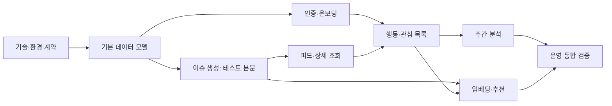

# 구현 계획

초기 NestJS 실행 골격(api·batch·core, 빌드·테스트 설정)은 구현되었다. 아래 계획은 실제 업무 데이터 모델과 기능을 추가하는 순서와 수용 기준이다. 업무 구현은 해당 단계의 미결정 사항과 실행 계약을 확인한 후 시작한다.

영속 ID 버전은 UUIDv7으로 확정했다. `libs/core`의 UUIDv7 ID 생성기가 신규 내부 UUID 식별자를 애플리케이션에서 생성하고, PostgreSQL `uuid` 타입에 저장한다. FK는 참조 ID를 그대로 사용한다. 데이터 모델 구현 시 실제 생성 경로의 v7 버전과 저장·조회 왕복을 검증한다. 상세 기준은 [ERD의 영속 ID 정책](erd.md#영속-id-정책)을 따른다.

## 의존 순서

## 단계별 작업

| 단계 | 작업 | 완료 기준 | 주요 검증 | 먼저 닫을 항목 |
| --- | --- | --- | --- | --- |
| 0. 실행 기반 | 언어·프레임워크·빌드·테스트·DB 버전·환경 분리 선정 | 로컬 실행/테스트 명령과 개발 DB 연결 재현 | 빈 환경에서 시작 가능, 테스트/운영 입력 분리 | O-01, O-02 |
| 1. 데이터 모델 | ERD 엔티티·DDL·마이그레이션, FK·복합 UNIQUE·상태 검사 | 19개 중 선택 테이블 제외 여부 반영, 제약 일치 | 중복/잘못된 FK/상태별 필수값 실패 확인 | O-03, O-04, O-10 |
| 2. 생성 계약 | 검색/본문/LLM 어댑터 인터페이스, 테스트 본문 기반 job | 신규 생성→검증→공개 또는 실패, 재보도 생성 없음 | 동시 후보·초안 재조회, 검증 실패 비공개, 입력 유실 재시도 | O-02, O-05, O-06 |
| 3. 인증·온보딩 | 카카오 로그인, refresh 회전, 분류/대상 선택 | 로그인·갱신·로그아웃·온보딩 완료/건너뛰기 | 토큰 재사용/만료/동시 갱신, 선호 중복 방지 | O-07 |
| 4. 피드·상세 | 공개 카드·상세·근거 조회, 목록 페이지네이션 | 비공개 제외, UI 요약·관점·용어 응답 | 공개 중단, 상세 미존재, 삭제 출처 처리 | O-08 |
| 5. 행동 | LIKE/SKIP/PASS 수용, 선호 반영, 관심 목록 | 동일 이벤트 1회 반영, 최신 행동 정확 | 재전송/동시 요청/충돌 payload/시간 동률 | O-08, O-09 |
| 6. 보고서 | 지난주 입력 집계·분석·결과 조회·실패 안내 | 사용자·주차 1행, 성공 결과 고정 | KST 경계/늦은 도착/저표본/타 사용자 근거 거절 | O-05, O-11 |
| 7. 추천 | 임베딩 생성/갱신, 관련·주요 이슈 후보 | 공개·중복·행동 필터, 부족한 후보 허용 | 다른 모델 혼합 방지, 동일 사건 오판 평가 | O-06, O-09, O-11 |
| 8. 운영 | 실제 공급자 연동·사용량·실패 복구·삭제 | 실제 본문에서 검증된 이슈 공개, 운영 절차 문서화 | 타임아웃 UNKNOWN, 프로세스 종료, 회원 삭제, 중단 근거 숨김 | O-02, O-05, O-10, O-12 |

사용량 기록은 2단계부터 외부 호출에 연결한다. 8단계에서 뒤늦게 추가하는 기능이 아니다. DB 기반 어댑터/외부 서비스와의 경계를 먼저 정하되 지금 Spring, 외부 큐, 객체 저장소 등의 사용을 임의 확정하지 않는다.

## 미결정 사항

| ID | 결정할 내용 | 영향과 종료 기준 |
| --- | --- | --- |
| O-01 | 언어·프레임워크·DB/pgvector 버전·빌드 도구 | 실제 실행/검증 명령을 문서화하면 종료 |
| O-02 | Google/Naver 검색 API, 본문 공급자, 수집 조건·개수·길이 상한 | 응답 샘플과 실패 사례, 사용 가능한 본문 경로 확인. 그 전에는 테스트 어댑터로 진행 |
| O-03 | article_discoveries 도입 여부 | 공급자별 발견 이력 조회 필요성 확인. 필요 없으면 선택 테이블 제외 |
| O-04 | UUIDv7 DB 기본값, 시각 기본값, 분류 초기 데이터 | UUID 버전·`uuid` 라이브러리·애플리케이션 생성 위치는 확정. DB 생성용 DEFAULT는 사용하지 않으며, DDL/응답 타입·seed 목록은 데이터 모델 단계에서 확정 |
| O-05 | 등록 직렬화, 워커 소유/종료 확인, 보고서 RUNNING 복구 | 현재 소유자 컬럼 없이 복구 가능한 실행 관리 계약 확정. 시간 초과만으로 재실행 금지 |
| O-06 | LLM/임베딩 모델·차원, 근거 수·검증·유사도 기준 | 샘플 평가에서 중복/후속 오판과 공개 검증 기준 수립 |
| O-07 | 세션 만료·재사용 탐지 시 취소 범위·저장 방식 | 현재 단순 refresh 테이블로 충족할 인증 계약 확정 |
| O-08 | API 경로·페이지네이션·오류 형식, 제스처→행동, 이벤트 id·시간 정밀도 | 프론트와 동일 재전송·순서·단위 계약 확인 |
| O-09 | 행동 점수·체류 가산·반복 행동 상한·무행동 노출 추적 | 추천 계산 규칙 확정. 없는 필드에 의존한 감쇠/열람 판정 제거 |
| O-10 | 이벤트·보고서·작업·사용량 보존과 삭제 | 최신 관심 복원, JSON 참조, 탈퇴 삭제를 유지하는 절차 확정 |
| O-11 | 추천 결과/주요 목록의 주간 고정 여부 | 조회형 응답 또는 별도 JSON 저장 계약 확정. 분석 근거와 혼합하지 않음 |
| O-12 | 호출별 비용 산출, 동시성·재시도·입력 상한 | 사용량 측정 단위 및 운영 중단 기준 확정. 강한 예산 상한이 필요하면 별도 설계 |

## 필수 수용 시나리오

| ID | 입력/장애 | 기대 결과 |
| --- | --- | --- |
| T-01 | 두 검색 공급자가 같은 원문 반환 | article_url 기준 기사 중복 없음 |
| T-02 | 같은 발표 재보도 | 새 issue/job 0건, 검증 없이 새 근거 연결하지 않음 |
| T-03 | 신청일 확정 후 그 사실을 재보도 | 첫 후속만 새 이슈. 재보도는 또 생성하지 않음 |
| T-04 | 두 배치가 동시에 같은 후보 등록 | 미공개 초안 포함 재확인으로 중복 등록 방지 |
| T-05 | 생성 후 JSON/근거 검증 실패 | 공개 없음, job FAILED 및 오류 |
| T-06 | GENERATE 중 프로세스 종료 | 입력 유실을 인지, 종료 확인 뒤 필요한 단계 재실행 |
| T-07 | job 성공 커밋 직후 연결 종료 | 재조회로 성공 확인. 초기 job 재등록/내용 재생성 방지 |
| T-08 | 같은 이벤트 id 재전송 | 이벤트·점수 1회만 반영; 다른 payload 거절 |
| T-09 | 동시 LIKE/SKIP 및 동일 시각 | 정의한 서버 수용 순서와 최신 관심 상태 일치 |
| T-10 | 일요일 LIKE, 월요일 SKIP | 지난주 포함, 현재 목록 제외 |
| T-11 | 지난주에 발생했지만 다음 주 서버 도착 | 지난주 보고서에 소급하지 않음 |
| T-12 | 저표본/연결 없음 | 안내 content로 SUCCEEDED 가능, 실패와 구분 |
| T-13 | 다른 사용자 집계 이슈를 분석 근거로 출력 | 서버 검증에서 거절 |
| T-14 | 보고서 인용 이슈 공개 중단 | 해당 근거 기반 문장 숨김/안내 |
| T-15 | LLM 타임아웃, 과금 여부 불명 | UNKNOWN 및 미확인 비용 NULL |
| T-16 | 회원 탈퇴 | 개인 세션·선호·행동·보고서 삭제, 공유 콘텐츠 유지 |

## 구현 착수 기록

각 단계 착수 시 다음을 기록한다.

- 승인된 범위와 연결 요구사항 ID
- 결정한 O-항목과 남은 제약
- 변경할 코드/마이그레이션 범위
- 유지할 불변식 및 실패 처리
- 실제 실행 가능한 검증 명령과 T-시나리오

0단계 실행 골격은 [구현 제어 문서](nestjs-foundation-implementation.html)에 기록된 명령으로 검증했다. 현재 O-01의 업무 데이터 모델·DDL·마이그레이션 세부 결정은 남아 있으며, 이 문서의 후속 단계는 아직 실행하지 않았다.
