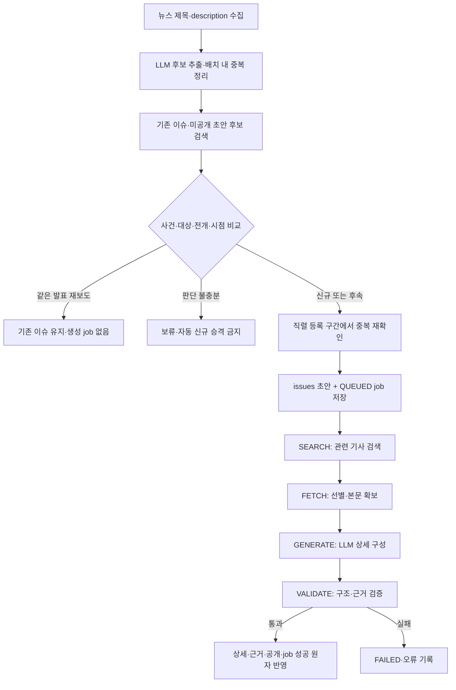
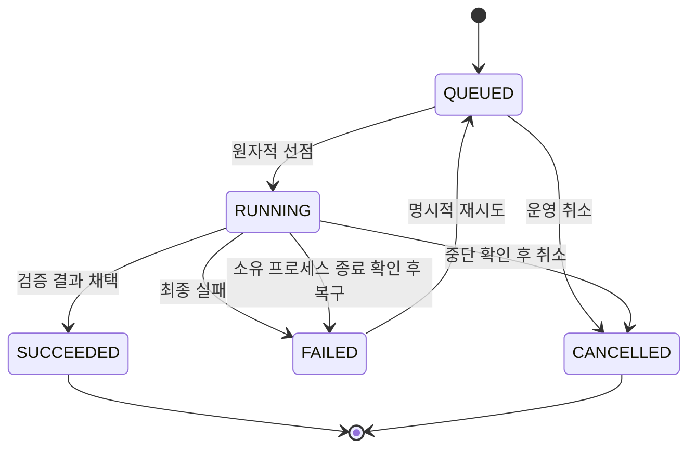
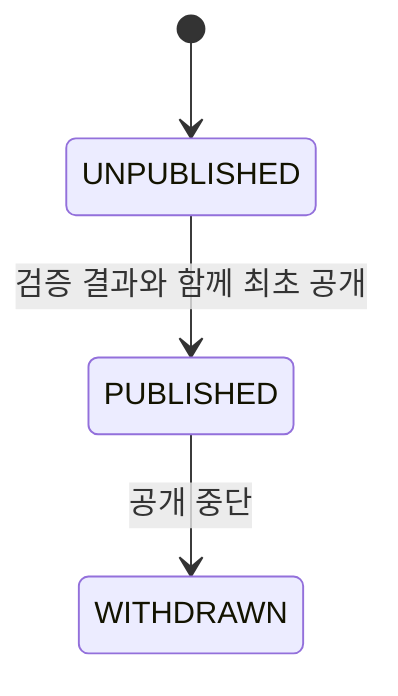

# 이슈 생성 파이프라인

## 범위

이슈 발견은 뉴스 제목·description으로 시작한다. **후보 이슈를 먼저 판정하고 신규 초안을 만든 뒤, 해당 이슈의 근거 기사를 검색·확보·가공한다.** 기사를 수집했다는 이유만으로 새 이슈가 되는 것은 아니다.

본문 공급자는 미확정이다. 테스트용 본문으로 입력/출력 계약을 먼저 검증한다. Google/Naver의 구체 API·검색어·수집 개수·페이지네이션·호출 주기는 공급자 조사와 별도 계약이 필요하며, 현재 확정된 값으로 취급하지 않는다.

## 전체 흐름

## 단계별 계약

| 단계 | 입력 | 처리 주체·LLM 개입 | 출력 | 영속화 |
| --- | --- | --- | --- | --- |
| 발견 수집 | 설정된 공급자·검색 조건 | 공급자 어댑터. LLM 불필요 | 제목, description, 원문 URL, 언론사, 발행 시각 | articles 메타데이터. 선택적으로 discoveries |
| 후보 추출 | 중복 제거한 제목·description과 article_id | LLM: 사건/전개 단위 후보 정리 | 후보 제목, 범위 설명, 확인 사실, 근거 article_id | 배치 메모리. 별도 후보 테이블 없음 |
| 기존 후보 검색 | 후보 제목·설명·대상·시점 | 텍스트·임베딩 조회 | 유사한 기존 이슈 및 미공개 초안 | 검색 결과 영속화 없음 |
| 동일성 판단 | 신규 후보 + 검색된 이슈 + 근거 메타데이터 | 명확한 중복 규칙 우선. 자연어 비교가 필요하면 LLM | DUPLICATE / NEW / UNCERTAIN, 기존 ID, 판단 이유, 후속 후보 | 배치 메모리. 판단값은 job 상태 enum 아님 |
| 등록 | NEW 후보, 판단 근거 | 등록 조정 구간 직렬화·최신 중복 재확인 | 신규 issue_id, job_id | issues UNPUBLISHED + issue_content_jobs QUEUED 원자 저장 |
| SEARCH | 초안 제목, 실행 중 범위·검색 문맥 | 검색 API. LLM 검색 도구에 전체 과정을 위임하지 않음 | 관련 기사 메타데이터 후보 | articles. 검색 순위/선택 중간값은 메모리 |
| FETCH | 관련 기사 후보 | 규칙 선별·본문 어댑터. 필요한 모호한 선별만 LLM | 확보한 본문, article_id, 작성에 사용할 근거 묶음 | 본문은 작업 메모리 |
| GENERATE | 본문·근거 ID·출력 JSON 규격·프롬프트 | LLM: 1줄/3줄 요약·관점·용어 구성 | 검증 전 상세 JSON | 검증 전 결과는 메모리 |
| VALIDATE | 생성 결과와 동일한 입력 근거 | 서버 구조/ID 검사 + 필요한 사실 검증. LLM 검사도 무오류 판정으로 간주하지 않음 | 통과/실패, 오류 이유 | 실패는 last_error; 통과 결과만 상세 저장 |
| 공개 | 검증된 상세·근거 및 job | 서비스 트랜잭션 | 공개 이슈 | issue_details, issue_articles, PUBLISHED, SUCCEEDED 함께 반영 |
| 임베딩 | 최종 제목 + 1줄 요약 | 임베딩 모델 | vector(D), 입력 hash/version | issue_embeddings upsert |

공개 후 임베딩 생성에 실패해도 텍스트·미공개 초안 검색 경로를 생략해서는 안 된다. 임베딩 재생성의 실행 주체와 재시도 스케줄은 구현 계약에서 정한다. 현재 job의 stage enum에 EMBED가 있다고 가정하지 않는다.

## 기존 이슈 비교

1. 이번 배치 내부 후보를 먼저 중복 정리한다.
2. 기존 공개 이슈뿐 아니라 이미 등록한 미공개 초안을 조회한다.
3. 제목+요약 임베딩은 **검색 후보를 줄이는 신호**다. 비슷한 수치가 같은 사건을 뜻하지 않는다.
4. 핵심 사건·정책 대상·전개·회차/시점을 비교한다. 대상 교집합이나 날짜 차이 하나로 확정하지 않는다.
5. 최근 기간 검색을 우선할 수 있지만 오래 지속되는 사안을 무조건 제외하지 않는다.
6. DUPLICATE는 새 job을 만들지 않는다. issue_articles는 근거 전용이므로 단순 발견 기사 전부를 자동 연결하지 않는다.
7. NEW 중 후속 전개는 새 이슈로 생성한다. FOLLOW_UP은 별도의 근거 검증 후 저장한다.
8. UNCERTAIN은 보류한다. 보류 횟수·경과 시간만으로 NEW로 바꾸지 않는다.

후보 등록 직렬화와 콘텐츠 생성 병렬화는 서로 다른 책임이다. 긴 외부 LLM 호출을 DB 행 잠금 트랜잭션 안에 유지하지 않는다. 비교 후 등록 사이에 새 초안이 생겼다면 재비교한다. 구체적인 조정 방식은 [구현 계획](implementation-plan.md)의 O-05에서 닫는다.

## 상태 머신

RUNNING 중 stage는 SEARCH → FETCH → GENERATE → VALIDATE로 진행한다. stage는 현재 진행 위치이며 중간 결과의 존재를 보장하지 않는다. 재시도에는 필요한 시작 stage를 다시 지정한다.

WITHDRAWN 자동 재공개는 없다. 정정·재공개 워크플로는 현재 초기 생성 job으로 지원한다고 가정하지 않는다.

## 트랜잭션과 복구

- 초안+job 등록은 한 트랜잭션이다. 동일 이슈의 QUEUED/RUNNING job은 부분 UNIQUE로 하나만 허용한다.
- 성공한 초기 생성의 새 job 등록도 서비스에서 거절한다. 활성 job UNIQUE만으로 완료 작업 중복을 막을 수 없다.
- 워커는 QUEUED를 짧은 트랜잭션에서 선점하고 RUNNING으로 전환한 뒤 외부 호출을 시작한다.
- 공개 시 job이 여전히 실행 가능하고 이슈가 공개 중단 상태가 아닌지 확인한다. 상세·근거·공개·job 성공을 원자 반영한다.
- started_at은 최초 실행, finished_at은 최종 성공/실패/취소 시각이다. 운영 재시도 시 finished_at을 비운다.
- 메모리에 입력이 남아 있으면 해당 호출을 제한적으로 재시도한다. 프로세스가 종료되면 본문 등 필요한 입력을 다시 확보한다.
- 같은 프로세스의 작업이 살아 있는지 불명확하면 시간 초과만으로 중복 실행하지 않는다. **현재 컬럼에는 소유 워커·heartbeat가 없으므로**, 외부 실행 관리 방식 또는 단일 워커 운영 계약이 필요하다.
- 초기 초안은 상세가 없고 후보 문맥도 영속화하지 않는다. 재시작 시 제목만으로 문맥을 복구하기 부족하면 새 검색 결과로 재검증하거나 FAILED를 유지한다. 임의로 좁은 사건 범위를 추측하지 않는다.

## 토큰·비용 통제

- 기사 URL 중복, 명확한 재보도, 비관련 기사는 규칙으로 먼저 제거한다.
- 후보 추출에는 제목·description을 사용하고, 전체 본문은 신규 이슈 상세 작성 시 필요한 근거만 넣는다.
- 이슈 임베딩과 상세를 사용자별로 다시 생성하지 않는다.
- 검색·본문 확보·생성을 하나의 거대한 LLM 호출로 합치지 않는다.
- 외부 호출별 ai_usage_records를 기록한다. 실제 재호출은 별도 행이며 결과 불명 호출은 UNKNOWN이다.
- 수집 개수, 본문 길이, 근거 수, 출력 토큰, 동시 실행 수, 재시도 상한은 설정값으로 둔다. 아직 숫자를 확정하지 않는다.
- 영구 중간 입력 저장을 생략한 선택은 재시작 비용을 증가시킬 수 있다. 이를 “실패해도 토큰 낭비 없음”으로 설명하지 않는다.
